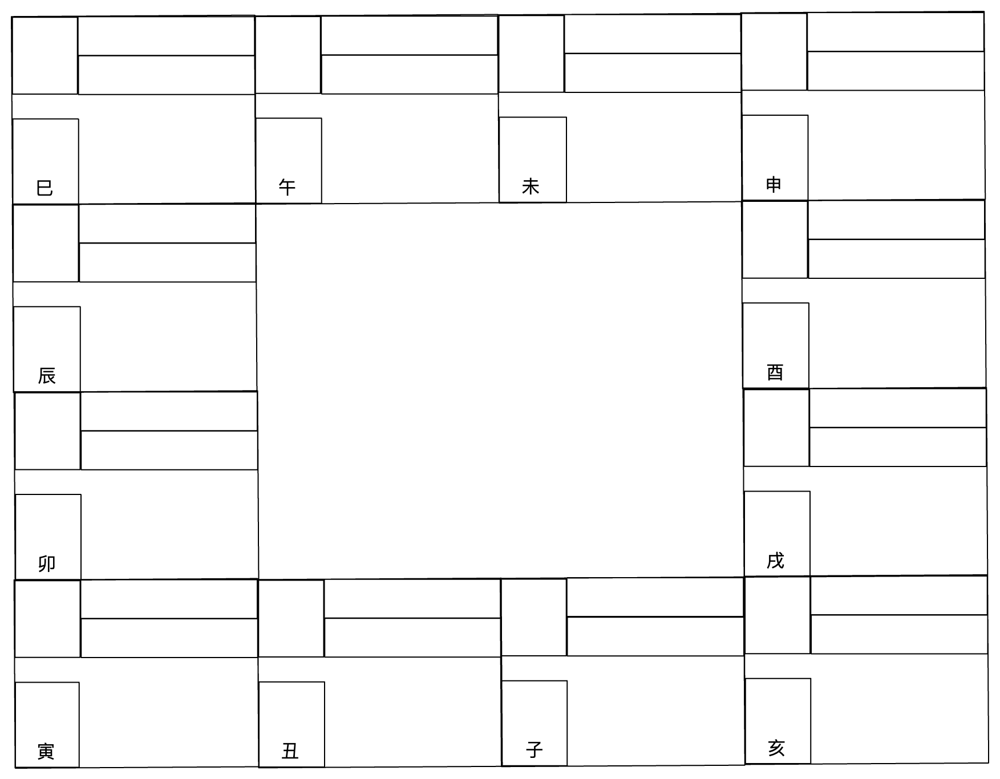
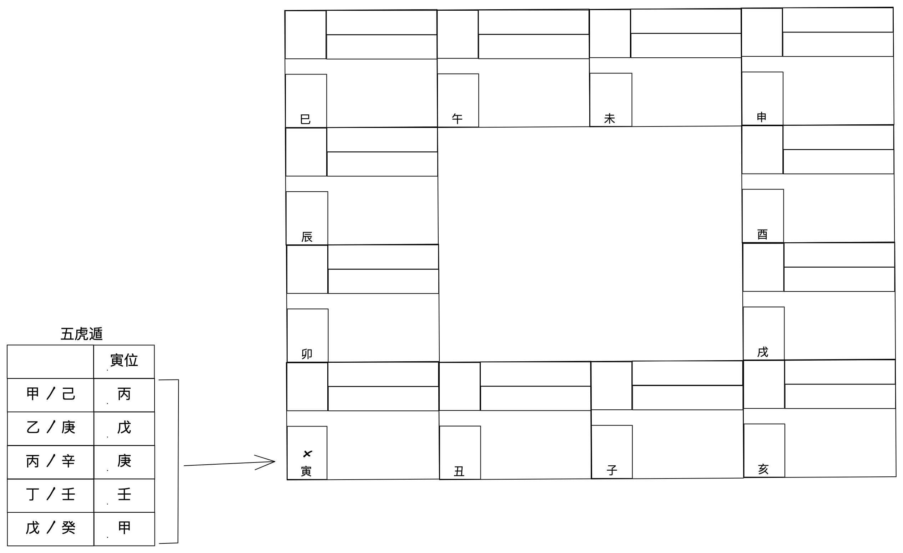
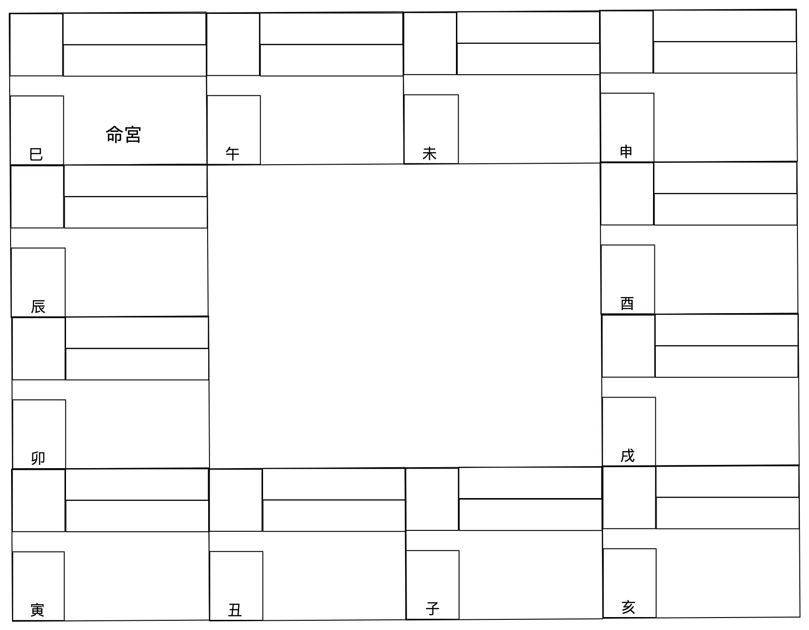
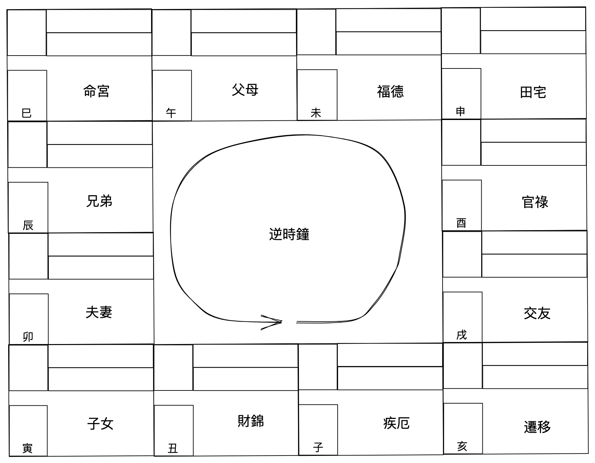

# 第一单元

Date: March 6, 2023
teacher: 惠民

## 什么是紫微斗数？

1. 中华传统并完整的命理工具
    
    天（命）⇒ 地（年） ⇒人（时）
    
2. 结合人出生的时间（年月日时），地点和性别等因素来进行命运的推算预测
3. 只注重磁场的概念
4. 除了推算命运，也可以判断生肖与风水喜忌等用途

## 紫微跟别命理的差别

### 紫微斗数

数，五行不平衡

精细，物质，构造

阴阳合历，月亮绕地球

正月初一尾新的一年

大概每四年一闰月

### 子平八字

气，五行平衡论

概念，格式，构思

农历，地球绕月球

立春为新的一年

使用二十四节气

## 术数基础

1. 以【磁场】为主要概念。什么是【磁场】
2. 人体对磁场感应力因人而异，约三个月～三年成立。快还是慢
3. 命运的趋吉避凶重点在于修正人体磁场
4. 事件成立亦视乎磁场的感应力。

### 什么是【磁场】

古时称之为《气》

科学家称之为Magnetic Field

生物就有自己的磁场

例子：情侣只要同居超过三个月，就已经产生磁场

## 以命理的角度

1. 什么是结婚的定义？
    
    同居超过三个月以上
    
2. 什么是离婚的定义
    
    离居
    
3. 什么是换工的定义
    
    环境，工作性质
    
4. 怎么才算是远行
    
    只看距离
    

## 【磁场】如何影响命运

- 根据人类的习惯性《活动范围》去衡量力度
- 命盘看到的事件是《超越》人类习惯性活动范围
    
    例子：月事算血光吗？除非超过平常的范围，不然不算。
    

## 怎么利用【磁场】改善命运

- 与人类的磁场《频率》接近相同
- 磁场《力度》需要至少大于人体三分之一
- 时常《接触》

### 阴阳概念

| 阳 | 男 | 左 | 上 | 单 | 贵 | 显 |
| --- | --- | --- | --- | --- | --- | --- |
| 阴 | 女 | 右 | 下 | 双 | 富 | 隐 |

### 五行生克

- 五行生克只能用于五行平衡论
- 紫微斗数以【数】为概念，既是五行不平衡，因此不采用

### 天干

| 甲 | 乙 | 丙 | 丁 | 戊 | 己 | 庚 | 辛 | 壬 | 癸 |
| --- | --- | --- | --- | --- | --- | --- | --- | --- | --- |

### 地支

| 子 | 丑 | 寅 | 卯 | 辰 | 巳 | 午 | 未 | 申 | 酉 | 戌 | 亥 |
| --- | --- | --- | --- | --- | --- | --- | --- | --- | --- | --- | --- |
| 11pm  | 1am | 3am  | 5am  | 7am  | 9am  | 11am  | 1pm  | 3pm | 5pm | 7pm  | 9pm |
| 1am | 3am | 5am | 7am | 9am | 11am | 1pm | 3pm | 5pm | 7pm | 9pm |  11pm |

## 排命盘

### 基本命盘格式



### 1. 阳历换成阴历

例子：1968

1. x = 西历年 （十位数） - 23
    
    = 68 -23 = 45
    
2. x/10 。。。余数（生年天干）
    
    = 45/10
    
    =5（余数）→ 戊
    
3. x/12。。。余数（生年地支）
    
    = 45/12
    
    = 9（余数）→申
    

生年：戊申

### 2. 分阴阳

出生年的天干所属之阴阳为准

单→阳

双→阴

例子：天干“戊”为属阳，故为阳女

### 3.定宫干

出生年的天干为对应之天干即为寅位的宫干



尋出寅位天干後,依天干順序,宮位順行逐宮排列宮干。

天干順序: 甲→...→癸

例子:戊申年,天干"戊"·故其在寅位的宮于是甲干。

### 4. 定命宫

出生的月份配出生時辰之交接處即為【命宮】位置

||子  |丑  |寅  |卯  |辰  |巳  |午  |未  |申  |酉  |戌  |亥  |
|------|---|---|---|---|---|---|---|---|---|---|---|---|
|一月    |寅  |丑  |子  |亥  |戌  |酉  |申  |未  |午  |巳  |辰  |卯  |
|二月    |卯  |寅  |丑  |子  |亥  |戌  |酉  |申  |未  |午  |巳  |辰  |
|三月    |辰  |卯  |寅  |丑  |子  |亥  |戌  |酉  |申  |未  |午  |巳  |
|四月    |巳  |辰  |卯  |寅  |丑  |子  |亥  |戌  |酉  |申  |未  |午  |
|五月    |午  |巳  |辰  |卯  |寅  |丑  |子  |亥  |戌  |酉  |申  |未  |
|六月    |未  |午  |巳  |辰  |卯  |寅  |丑  |子  |亥  |戌  |酉  |申  |
|七月    |申  |未  |午  |巳  |辰  |卯  |寅  |丑  |子  |亥  |戌  |酉  |
|八月    |酉  |申  |未  |午  |巳  |辰  |卯  |寅  |丑  |子  |亥  |戌  |
|九月    |戌  |酉  |申  |未  |午  |巳  |辰  |卯  |寅  |丑  |子  |亥  |
|十月    |亥  |戌  |酉  |申  |未  |午  |巳  |辰  |卯  |寅  |丑  |子  |
|十一月   |子  |亥  |戌  |酉  |申  |未  |午  |巳  |辰  |卯  |寅  |丑  |
|十二月   |丑  |子  |亥  |戌  |酉  |申  |未  |午  |巳  |辰  |卯  |寅  |


例子：

八月辰時生

查得地支為“巳”

因此【命宮】是在```巳地```



### 5. 安十二人事宮

【命宮】為起始，逆時鐘方向，每一格安一個人事宮位，依次為：



### 6. 定五行局
【命宮】天干配命宮地支之交接處即為五行局

||  子 / 丑 / 午 / 未 |  寅 / 卯 / 申 / 酉 |  辰 / 巳 / 戌 / 亥 |
| --- | --- | --- | --- |
| 甲 / 乙 | 金四局 | 水二局 | 火六局 |
| 甲 / 乙 | 水二局 | 火六局 | 土五局 |
| 甲 / 乙 | 火六局 | 土五局 | 木三局 |
| 甲 / 乙 | 土五局 | 木三局 | 金四局 |
| 甲 / 乙 | 木三局 | 金四局 | 水二局 |

例子：
【命宮】在```巳地```，宮位的天干地支為```丁巳```，查得```土五局```

### 7. 尋紫微星
出生日子配五行局之交接處即為紫微星位置
||水二局|木三局|金四局|土五局|火六局|
|------|---|---|---|---|---|
|初一     |丑  |辰  |亥  |午  |酉  |
|初二    |寅  |丑  |辰  |亥  |午  |
|初三    |寅  |寅  |丑  |辰  |亥  |
|初四    |卯  |巳  |寅  |丑  |辰  |
|初五    |卯  |寅  |子  |寅  |丑  |
|初六    |辰  |卯  |巳  |未  |寅  |
|初七    |辰  |午  |寅  |子  |戌  |
|初八    |巳  |卯  |卯  |巳  |未  |
|初九    |巳  |辰  |丑  |寅  |子  |
|初十    |午  |未  |午  |卯  |巳  |
|十一    |午  |辰  |卯  |申  |寅  |
|十二    |未  |巳  |辰  |丑  |卯  |
|十三    |未  |申  |寅  |午  |亥  |
|十四    |申  |巳  |未  |卯  |申  |
|十五    |申  |午  |辰  |辰  |丑  |
|十六    |酉  |酉  |已  |酉  |午  |
|十七    |酉  |午  |卯  |寅  |卯  |
|十八    |戌  |未  |申  |未  |辰  |
|十九    |戌  |戌  |巳  |辰  |子  |
|二十    |亥  |未  |午  |巳  |酉  |
|廿一    |亥  |申  |辰  |戌  |寅  |
|廿二    |子  |亥  |酉  |卯  |未  |
|廿三    |子  |申  |午  |申  |辰  |
|廿四    |丑  |酉  |未  |巳  |巳  |
|廿五    |丑  |子  |巳  |午  |丑  |
|廿六    |寅  |酉  |戌  |亥  |戌  |
|廿七    |寅  |戌  |未  |辰  |卯  |
|廿八    |卯  |丑  |申  |酉  |申  |
|廿九    |卯  |戌  |午  |午  |巳  |
|三十    |辰  |亥  |亥  |未  |午  |

例子：28日生 - 土五局，查表得```酉```，即```紫微```星在```酉```宮位

### 8. 安十四主星

尋出紫微星的位置，按照表哥依序將此十四主星排列在命盤。

||1|2|3|4|5|6|7|8|9|10|11|12|
|------|------|------|------|------|------|------|------|------|-------|-------|-------|-------|
|紫微    |子     |丑     |寅     |卯     |辰     |巳     |午     |未     |申      |酉      |戌      |亥      |
|天府    |辰     |卯     |寅     |丑     |子     |亥     |戌     |酉     |申      |未      |午      |巳      |
|天梁    |酉     |申     |未     |午     |巳     |辰     |卯     |寅     |丑      |子      |亥      |戌      |
|天同    |未     |申     |酉     |戌     |亥     |子     |丑     |寅     |卯      |辰      |巳      |午      |
|天機    |亥     |子     |丑     |酉     |卯     |辰     |巳     |午     |未      |申      |酉      |戌      |
|七殺    |戌     |酉     |申     |未     |午     |巳     |辰     |卯     |寅      |丑      |子      |亥      |
|天相    |申     |未     |午     |巳     |辰     |卯     |寅     |丑     |子      |亥      |戌      |酉      |
|武曲    |申     |酉     |戌     |亥     |子     |丑     |寅     |卯     |辰      |巳      |午      |未      |
|貪狼    |午     |巳     |辰     |卯     |寅     |丑     |子     |亥     |戌      |酉      |申      |未      |
|太陽    |酉     |戌     |亥     |子     |丑     |寅     |卯     |辰     |巳      |午      |未      |申      |
|破軍    |寅     |丑     |子     |亥     |戌     |酉     |申     |未     |午      |巳      |辰      |卯      |
|太陰    |巳     |辰     |卯     |酉     |丑     |子     |亥     |戌     |酉      |申      |未      |午      |
|廉貞    |辰     |巳     |午     |未     |申     |酉     |戌     |亥     |子      |丑      |寅      |卯      |
|巨門    |未     |午     |巳     |辰     |卯     |寅     |丑     |子     |亥      |戌      |酉      |申      |

### 9. 輔助星
1. 左輔，右弼

    查一下圖表，出生月份所處的宮位即為左輔星及右弼星之位置

    ||1|2|3|4|5|6|7|8|9|10|11|12|
    | --- | --- | --- | --- | --- | --- | --- | --- | --- | --- | --- | --- | --- |
    |左輔| 辰 | 巳 | 午 | 未 | 申 | 酉 | 戌 | 亥 | 子 | 丑 | 寅 | 卯 | 
    |右弼| 戌 | 酉 | 申 | 未 | 午 | 巳 | 辰 | 卯 | 寅 | 丑 | 子 | 亥 |          

2. 文昌，文曲

    查一下圖表，出生時辰所處的宮位即為文昌星及文曲星之位置

    |時辰 |子  |丑  |寅  |卯  |辰  |巳  |午  |未  |申  |酉  |戌  |亥  |
    | --- | --- | --- | --- | --- | --- | --- | --- | --- | --- | --- | --- | --- |
    |文昌 |戌  |酉  |申  |未  |午  |巳  |辰  |卯  |寅  |丑  |子  |亥  |
    |文曲 |辰  |巳  |午  |未  |申  |酉  |戌  |亥  |子  |丑  |寅  |卯  |

### 10. 神煞星
先跳過

### 11. 安四化星
下表左列為出生年天干所對應的四化星～祿，權，科，忌

依次填入星系下方

||化祿 |化權 |化科 |化忌 |
|------|---|---|---|---|
|甲     |廉貞 |破軍 |武曲 |太陽 |
|乙     |天機 |天梁 |紫微 |太陰 |
|丙     |天同 |天機 |文昌 |廉貞 |
|丁     |太陰 |天同 |天機 |巨門 |
|戊     |貪狼 |太陰 |右弼 |天機 |
|己     |武曲 |貪狼 |天梁 |文曲 |
|庚     |太陽 |武曲 |太陰 |天同 |
|辛     |巨門 |太陽 |文曲 |文昌 |
|壬     |天梁 |紫微 |左輔 |武曲 |
|癸     |破軍 |巨門 |太陰 |貪狼 |
