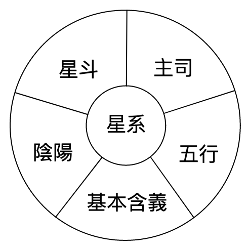

# 第二单元

## 十四主星

### 星系重點

### 星系陰陽與南北斗
| | 南斗星 | 北斗星 | 中天星 |
| --- | --- | --- | --- | 
| | 主文，精神生活 | 主武，物質生活 | 太陽 |
| 命 / 財 / 官 | 文職（白領）智取 策劃 | 武職（藍領）力敵 商業 | |
| | 主生 | 主死 | 太陰  |
| 疾厄 | 輕症，神經科，長壽 | 重症 | |
| | 主男 | 主女  | |
| 夫妻 | 女-緣分早 | 男-緣分早 | |
| 子女 | 兒子 | 女兒 | |

### 星系之五行
#### **火行**
| 太陽（陽） | 廉政（陰） |
| --- | --- |
| 太陽  | 彩虹 |
| 能量  | 燃燒 | 
| 耀眼  | 有顏色 | 
| 光明正大  | 按部就班 | 
| 正行正業  | 系統 | 
| 男性  |  | 

#### **金行**
| 七殺（陽） | 武曲（陰） |
| --- | --- |
| 火山  | 礦物  |
| 快捷  | 礦物質 | 
| 衝刺  | 金銀銅鐵錫 | 
| 沒耐心  | 財富 | 
| 無預警  | | 

#### **木行**
| 貪狼（陽） | 天機（陰） |
| --- | --- |
| 大樹  | 小草 |
| 甲木參天 | 風吹草動 不穩定 | 
| 進取心 | 平輩 | 
| 慾望 | 搞團體 | 
| 開花結果 | | 
| 桃花 | | 

#### **土行**
| 天府（陽） | 天梁（陽） | 紫微（陰） |
| --- | --- | --- |
| 沙漠  | 肥土 | 地核 |
| 初生之土 | 肥沃 | 地底下 | 
| 草木不生 | 長時間 | 資源豐富 | 
| 吸，守 | 老人家 | 包羅萬象 | 
| 保守 | 久，舊 | 上等 |  

#### **水行**
| 天相（陽） | 天同（陽） | 太陰（陰） | 破軍（陰） | 巨門（陰） |
| --- | --- | --- | --- | --- |
| 井水  | 山水 | 河水 | 海水 | 石油 |
| 基本需求 | 休閒 | 清潔 | 骯髒 | 地下水 水溝 | 
| 衣食住行 | 吃喝玩樂 | 女性 | 雜亂 | 隱藏 陰森 | 
| 可負擔 | 小孩 | 月亮 | 腐蝕 | 臭味 | 
| 可飲用 | 可飲用 | 可飲用 | 消耗 | 有顏色 |  

## 星系論

### **紫微**
| | |
| --- | --- |
| 星斗 | 北斗星 |
| 主司  | 官祿主 |

#### 含義
權利，孤立，高尚，資源豐富

#### 備注
三合或對面有輔助星，則紫微星得權

#### 四化
| 化祿 | 化權 | 化科 | 化忌 |
| --- | --- | --- | --- |
| - | - | - | - |

#### 宮位含義
| 宮位 |含義 | 化祿 | 化權 | 化科 | 化忌 |
| --- | --- | --- | --- | --- | --- |
| 命宮 | 權勢，霸道，上等人，獨來獨往 |  |  |  |  | 
| 財/官  | 事業有成，奢侈品，精密器材 |  |  |  |  |
| 疾厄 | 腸胃，富貴病  |  |  |  |  |
| 夫妻 | 姻緣遲，配偶剛強  |  |  |  |  |
| 田宅 | 高級住宅區  |  |  |  |  |
| 福德 | 想像力豐富，博學多才  |  |  |  |  |
| 兄弟 | 疏遠 |  |  |  |  |
| 子女 | 子女少 |  |  |  |  |
| 交友 | 朋友少 |  |  |  |  |
| 遷移 | 事業在外 |  |  |  |  |

### **破军**
| | |
| --- | --- |
| 星斗 | 北斗星 |
| 主司  | 主耗 |

#### 含義
消耗，雜亂，骯髒，先破後成

#### 宮位含義
| 宮位 |含義 | 化祿 | 化權 | 化科 | 化忌 |
| --- | --- | --- | --- | --- | --- |
| 命宮 | 愛頂撞 |  |  |  |  | 
| 財/官  | 先破後成，海產 |  |  |  |  |
| 疾厄 | 皮膚病，頭皮屑，衛生問題，痔瘡  |  |  |  |  |
| 夫妻 | 初戀難結合  |  |  |  |  |
| 田宅 | 第一次買，賣不成  |  |  |  |  |
| 福德 | 打從心底比較難接受外來建議，自身利益優先  |  |  |  |  |
| 兄弟 | 一開始關係不好 |  |  |  |  |
| 子女 | 一開始關係不好 |  |  |  |  |
| 交友 | 一開始關係不好 |  |  |  |  |
| 遷移 |  |  |  |  |  |

### **天機**
| | |
| --- | --- |
| 星斗 | 南斗星 |
| 五行 | 陰木 |
| 主司  | 兄弟主 |

#### 含義
動，平輩，智慧，思考，計謀，策劃

#### 宮位含義
| 宮位 |含義 | 化祿 | 化權 | 化科 | 化忌 |
| --- | --- | --- | --- | --- | --- |
| 命宮 | 善變，多計謀 |  |  |  | 想法比較不一樣 | 
| 財/官 | 文職，策劃，驛馬，動的產品，容易攜帶 | 資金流動 |  |  | 賣義肢 |
| 疾厄 | 心臟，手腳  | 多出來東西 |  |  | 心臟有孔，長短腳，過動 |
| 夫妻 | 變動，不穩定  | 花心，享受感情改變，需要保持距離 |  |  | 感情改變，需要保持距離 |
| 田宅 | 時常搬家  |  |  |  |  |
| 福德 | 善於思考/策劃  |  |  |  |  |
| 兄弟 | 兄弟姐妹很多 |  |  |  | 流失  |
| 父母 | 沒大沒小，沒有代溝，父母很長外出 | 沒有代溝 |  |  | 沒大沒小 |
| 子女 | 沒大沒小，沒有代溝，子女很長外出 | 沒有代溝 |  |  | 沒大沒小 |
| 交友 | 同輩朋友多 |  |  |  |  |
| 遷移 | 很長外出 |  |  |  |  |

### **天同**
| | |
| --- | --- |
| 星斗 | 南斗星 |
| 五行 | 山水 |
| 主司  | 福德主 |

#### 含義
情緒，休閒，晚輩，吃喝玩樂，圓形

#### 宮位含義
| 宮位 |含義 | 化祿 | 化權 | 化科 | 化忌 |
| --- | --- | --- | --- | --- | --- |
| 命宮 | 情緒化，孩子氣，單純，天真，幼稚 |  |  |  | 非常情緒化 | 
| 財/官 | 不積極，愛玩 | |  |  | |
| 疾厄 | 情緒，水疾，泌尿科  | |  | | 情緒病，水瘤（女性）圓形的疾病，生產有問題 |
| 夫妻 | 年齡有差距，不認真  | |  |  | |
| 田宅 | 家族晚輩  |  |  |  |  |
| 福德 | 善於思考/策劃  |  |  |  |  |
| 兄弟 | 兄弟姐妹很多 |  |  |  | 流失  |
| 父母 | 沒大沒小，沒有代溝，父母很長外出 | 沒有代溝 |  |  | 沒大沒小 |
| 子女 | 沒大沒小，沒有代溝，子女很長外出 | 沒有代溝 |  |  | 沒大沒小 |
| 交友 | 同輩朋友多 |  |  |  |  |
| 遷移 | 很長外出 |  |  |  |  |

### **天府**

#### 含義

### **天相**
| | |
| --- | --- |
| 星斗 | 南斗星 |
| 五行 | 阳水 |
| 主司  | 主衣食，主印(複印) |

#### 含義
基本需求，輔助，可負擔，宰相（輔助皇上即紫微）

#### 宮位含義
| 宮位 |含義 | 化祿 | 化權 | 化科 | 化忌 |
| --- | --- | --- | --- | --- | --- |
| 命宮 | 和事佬 |  |  |  |  | 
| 財/官 | 基本需求，攝影 |  |  |  | |
| 疾厄 | 水疾 | |  |  |  |
| 夫妻 | 傳統，互補不足  |  |  |  | |
| 田宅 | 可負擔 以你的交友圈的社會地位為標準 |  |  |  |  |
| 福德 |   |  |  |  |  |
| 兄弟 | 兄弟姐妹很多 |  |  |  |  |
| 父母 | 傳統，互補不足 |  |  |  |  |
| 子女 | 傳統，互補不足 |  |  |  |  |
| 交友 | 傳統，互補不足 |  |  |  |  |
| 遷移 | 大眾化的地方 |  |  |  |  |

### **七殺**
| | |
| --- | --- |
| 星斗 | 南斗星 |
| 五行 | 陽金 |
| 主司  | 主蕭殺 |

#### 含義
快捷，衝動，沒耐性，無預警

#### 宮位含義
| 宮位 |含義 | 化祿 | 化權 | 化科 | 化忌 |
| --- | --- | --- | --- | --- | --- |
| 命宮 | 急性子，勇往直前 |  |  |  |  | 
| 財/官 | 衝刺型，軍警 |  |  |  | |
| 疾厄 | 腸，傷，骨 | |  |  |  |
| 夫妻 | 閃電式，速食愛情  |  |  |  | |
| 田宅 | 快做決定 |  |  |  |  |
| 福德 |   |  |  |  |  |
| 兄弟 | 急性子 |  |  |  |  |
| 父母 | 急性子 |  |  |  |  |
| 子女 | 急性子 |  |  |  |  |
| 交友 | 急性子，很多淺交 |  |  |  |  |
| 遷移 | 說走就走 |  |  |  |  |

### **太陽**
| | |
| --- | --- |
| 星斗 | 中天星（傾向與北斗） |
| 五行 | 陽火 |
| 主司  | 官祿主 |

#### 含義
光明正大，耀眼，能量，男性

#### 宮位含義
| 宮位 |含義 | 化祿 | 化權 | 化科 | 化忌 |
| --- | --- | --- | --- | --- | --- |
| 命宮 | 豪爽，熱情 |  |  |  |  | 
| 財/官 | 熱門行業，大企業，產能業，男性用品 |  |  |  | |
| 疾厄 | 頭部，眼睛，心臟 | |  |  |  |
| 夫妻 | 自己/配偶桃花  |  |  |  | |
| 田宅 | 男丁，顯眼 |  |  |  |  |
| 福德 |   |  |  |  |  |
| 兄弟 | 急性子 |  |  |  |  |
| 父母 | 急性子 |  |  |  |  |
| 子女 | 急性子 |  |  |  |  |
| 交友 | 急性子，很多淺交 |  |  |  |  |
| 遷移 | 說走就走 |  |  |  |  |

#### 陰陽合論
| | | | | 
| --- | --- | --- | --- | 
| | 命宮，疾厄宮 | 太陽化忌 | 多災難，自刑，剋自己，男不像男（可選擇學習/從事折磨自己的事項）eg. 武术，柔道 | 
| 男命 | 命宮，疾厄宮，夫妻宫 | 太陰化忌 | 偏房（第二任） | 
| | 命宮，疾厄宮，夫妻宫，交友宮 | 太陰化祿 | 桃花命（只限女對象） | 
| | 命宮，疾厄宮 | 太陰化忌 | 多災難，自刑，剋自己，女不像女（可選擇學習/從事折磨自己的事項）eg. 芭蕾舞 | 
| 女命 | 命宮，疾厄宮，夫妻宫 | 太陽化忌 | 偏房（第二任） | 
| | 命宮，疾厄宮，夫妻宫，交友宮 | 太陽化祿 | 桃花命（只限男對象） | 

### **左輔，右弼**
| | |
| --- | --- |
| 星斗 | 輔助星 |
| 主司  | 官祿主 |

#### 含義
輔助，幫助

雙重，雙數

#### 宮位含義
| 宮位 |含義 | 化祿 | 化權 | 化科 | 化忌 |
| --- | --- | --- | --- | --- | --- |
| 命宮 | 有雙重性格 |  |  |  |  | 
| 財帛 | 兩個收入來源 |  |  |  | |
| 官祿 | 兩份工作 |  |  |  | |
| 疾厄 | 併發症 | |  |  |  |
| 夫妻 | 兩段婚姻  |  |  |  | |
| 田宅 | 有家族的幫助  |  |  |  | |
| 風水 | 擺放雙數 |  |  |  |  |

### **文昌，文曲**
| | |
| --- | --- |
| 星斗 | 輔助星 |
| 主司  | 官祿主 | 

#### 宮位含義
| 宮位 |含義 | 化祿 | 化權 | 化科 | 化忌 |
| --- | --- | --- | --- | --- | --- |
| 命宮 |  |  |  |  | 沒禮貌，沒知識，身上會有 一條條，一節節，一粒粒 | 
| 財帛 |  |  |  | 可以參與禮節習俗的事業 eg.結婚一條龍服務，文具店 | 沒有理財概念，賣壞的文書 eg.黑市樂透，走文書/禮節漏洞，不開單據的生意 |
| 官祿 |  |  |  |  | 虎頭蛇尾，行為沒有禮節 |
| 疾厄 |  | |  |  | 脊椎骨，肌肉，瘤 |
| 夫妻 |   |  |  |  | 禮節問題，文書問題，對方有禮節問題 |
| 田宅 |   |  |  |  | 家宅不寧，家醜外揚，白事 |
| 父母 |   |  |  |  | 父親無學識，沒盡父親的責任 |
| 遷移 |   |  |  |  | 被罰單，路痴，飛機延遲，爆胎，車電路，晶片 |

#### 特殊組合
1. 天機+昌曲+化忌=過河拆橋
2. 對面天機+昌曲+化忌=過河拆橋（有機會）

| 宮位 |含義 |
| --- | --- |
| 命 | 忘恩負義 |
| 財帛 | 被人坑，坑別人，主動拆橋 |
| 官祿 | 虎頭蛇尾 |
| 疾厄 | 心臟血管阻塞 |
| 夫妻 | 一夜情，不對感情負責，被離婚，分家產 |

1. 貪狼+昌曲+化忌=華而不實
2. 對面貪狼+昌曲+化忌=華而不實（有機會）

| 宮位 |含義 |
| --- | --- |
| 命 | 中看不中用，不切實際 |
| 財帛 | 金玉其表，虛有其表|
| 官祿 | 外表好看，內容空虛 廣告業 基金管理，冒牌貨，紙劄舖，模型 |
| 疾厄 | 內傷，內積血，骨折， 碎屍 |
| 夫妻 | 人前恩愛，人後各自精彩 |

1. 破軍+昌曲+化忌=水中作塚
2. 對面破軍+昌曲+化忌=水中作塚（有機會）

| 宮位 |含義 |
| --- | --- |
| 命 | 大破敗，沒有預兆 |
| 財帛 | 破財，冷，偏，專 |
| 官祿 | 破敗，冷，偏，專 |
| 疾厄 | 心臟病，中風 |
| 夫妻 | 感情破敗 |

## 雙星論
1. 兩顆星系都必須都沒有四化，或同時都有四化。因此，使用率較低。
2. 重點放在紫微星組，因為有些南斗星沒有四化。當北斗星一有四化，雙星含義就不成立了。

- 紫微天府：孤
- 廉貞天相：循序漸進
- **紫微貪狼**：桃花犯主，常社交
- 天機太陰：動
- 武曲破軍：慢慢消耗
- 廉貞七殺：一板一眼
- **紫微天相**：反傳統
- **天機巨門**：重零開始
- **太陽太陰**：動，一雙
- 武曲天府：守
- 紫微七殺：權利
- **天機天梁**：策劃，文職
- **太陽巨門**：競爭，熱門，夫妻宮：對方桃花命，疾厄女：乳房，疾厄男：心臟
- **天同太陰**：自由自在
- **廉貞破軍**：低級，雜亂
- **武曲貪狼**：遲
- **太陽天梁**：專業
- 武曲天相：慢慢順遂
- **天同巨門**：不成大事，感情用事，激勵講師
- 廉貞天府：挑剔
- **紫微破軍**：反傳統，野心
- 武曲七殺：逐漸改變
- **天同天梁**：喜歡自由
- **廉貞貪狼**：桃花，偏格，有藝術細胞

## 星系格局
有格先論格

### 機月同梁
天梁，天同，太陰，天機 在三合房方 （命，官，財）

含義：文職，平穩，策劃，一智取財

特點：外表斯文

優勢：諾做對行業，把握對的時機，此格局可以擁有至少三個黃金十年。

有利四化：乙，丙，丁